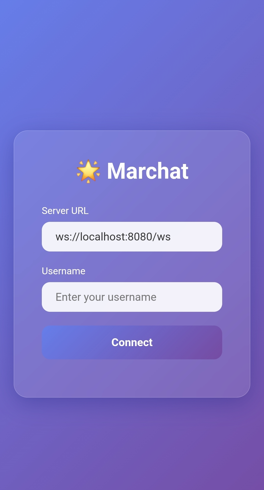
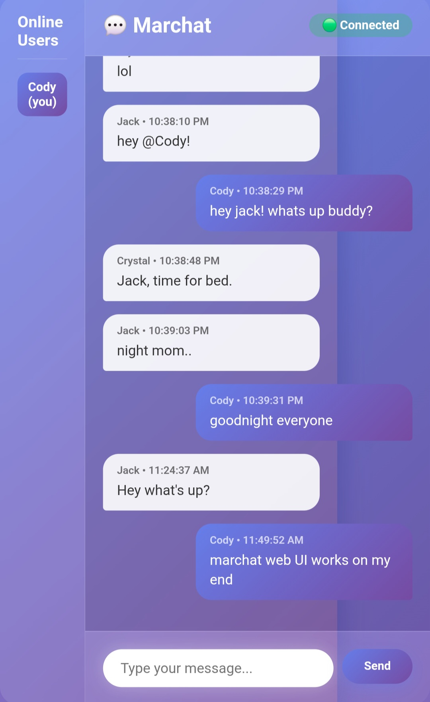

# marchat-webui

A standalone web-based graphical user interface prototype built in plain HTML, CSS, and JavaScript to demonstrate a possible graphical client for marchat.

---

## Overview

This project is an experimental mockup of a graphical chat client UI for marchat. It provides a lightweight, responsive interface for users who are not comfortable with the terminal. The UI demonstrates that marchat can support custom frontends while keeping the core server minimal and terminal-focused.

**Important:**
This GUI is **not part of the official marchat codebase** and does **not** represent an official or planned release. It is provided solely for testing and exploration purposes and may never be integrated or maintained as part of marchat.

---

## Features

* Connect to a marchat WebSocket server
* Show online users and connection status
* Send and receive chat messages and commands
* Responsive dark-themed UI
* Minimal footprint (approx. 17 KB)

---

## Screenshots

<table>
  <tr>
    <td></td>
    <td></td>
  </tr>
</table>

---

## Usage

1. Open `index.html` in a modern web browser.
2. Enter your marchat server WebSocket URL (e.g. `ws://localhost:8080/ws`) and click **Connect**.
3. Enter your username.
4. Type messages or commands (starting with `:`) in the input box.

---

## Purpose

This web UI is intended to demonstrate how a graphical client can interface with marchat. It allows developers and teams to provide access to users who prefer graphical interfaces while preserving the lightweight, terminal-focused design of the core server.

---

## Disclaimer

* This project is a proof of concept and is not actively maintained.
* Functionality depends on a compatible marchat server.
* No official support or warranty is provided.

---

## License

MIT License
See [LICENSE](LICENSE) for details.

---

## Contributions

Contributions are welcome, but note this is an experimental project and may be archived without further development.

---

*marchat’s primary client remains terminal-based; this GUI is an independent experimental interface.*
